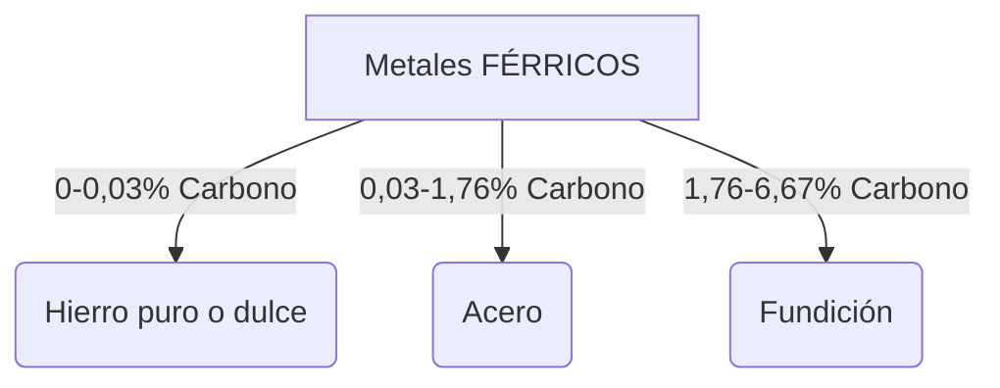
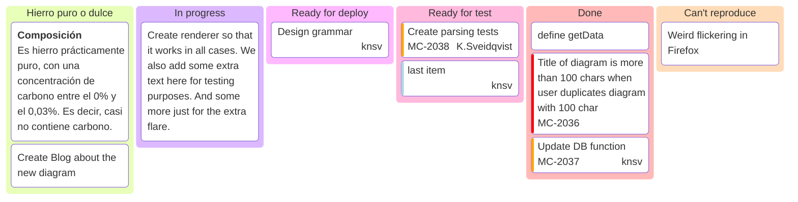
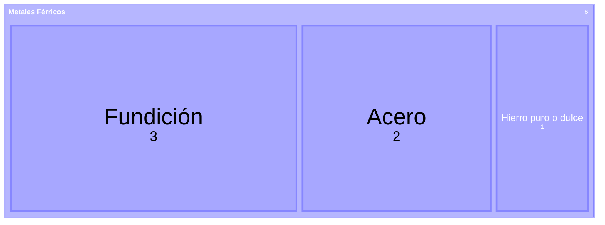

# Metales férricos

Los **metales férricos** (también llamados ferrosos) ⚙️ son aquellos que contienen **hierro** como elemento principal. El hierro puro es un metal relativamente frágil y quebradizo, por lo que se le añade pequeñas cantidades de carbono para mejorar sus propiedades. Según la cantidad de **carbono** que se mezcla con el hierro, obtenemos diferentes materiales con propiedades distintas.

!!!note "Metales férricos"
    Son aquellos cuyo elemento principal es el **hierro**.
    * Suele añadirse **carbono** en diferentes proporciones para mejorar sus propiedades mecánicas.

## Hierro puro o dulce (0-0,03% carbono) 🔩

**Composición**

Es hierro prácticamente puro, con una concentración de carbono entre el 0% y el 0,03%. Es decir, casi no contiene carbono.

**Propiedades**
- Metal de color blanco grisáceo
- Temperatura de fusión: 1.538°C
- **Dúctil y maleable:** se puede deformar con facilidad
- Tiene propiedades magnéticas (es atraído por imanes)
- **Se corroe y oxida con facilidad** (forma óxido)
- Punto de fusión muy elevado
- **Frágil y quebradizo**
- Difícil de mecanizar (taladrar, cortar, tornear)

**Aplicaciones**
Tiene **escasa utilidad en la industria**. Es el metal férrico **menos utilizado** porque sus desventajas superan a sus ventajas. Se usa muy poco debido a su fragilidad.

## Acero (0,03-1,76% carbono) 💪

**Composición**
Es una mezcla de **hierro** con una pequeña cantidad de **carbono** (entre 0,03% y 1,76%). Al añadir carbono al hierro puro, se mejoran notablemente sus propiedades.

**Propiedades**
- **Elevada dureza y tenacidad** (no se rompe fácilmente)
- **Mayor resistencia** a los esfuerzos y cargas
- **Óptimas propiedades mecánicas**
- Coste de obtención bajo
- Más resistente que el hierro puro

**Aplicaciones**
Es el **material férrico MÁS utilizado** en la industria:
- Elementos de máquinas (engranajes, ejes, tornillos)
- Estructuras metálicas (vigas de edificios y puentes)
- Herramientas (martillos, destornilladores, llaves)
- Industria automovilística (carrocerías de coches)
- Industria naval (barcos, cascos)

### Aceros aleados 🔬

Los **aceros aleados** son aceros (hierro más carbono) a los que se les añaden **otros elementos químicos** (además del hierro y el carbono) para **mejorar ciertas propiedades** o hacer que adquieran nuevas características especiales.

**Fórmula básica:**
**Acero aleado** = Hierro + Carbono + *Otro elemento químico*

**Ejemplos de aceros aleados**

| Elemento añadido | Propiedad que mejora | Aplicación |
|-----------------|---------------------|------------|
| **Cromo** | Resistencia a la corrosión | Acero inoxidable (cuberterías, fregaderos) |
| **Níquel** | Dureza y tenacidad | Herramientas de alta resistencia |
| **Wolframio** | Dureza a altas temperaturas | Brocas, herramientas de corte |
| **Manganeso** | Resistencia al desgaste | Raíles de tren, piezas sometidas a fricción |

El **acero inoxidable** es el acero aleado más conocido. Se obtiene añadiendo **cromo** al acero normal, lo que le da una gran resistencia a la oxidación y corrosión.

## Fundición (1,76-6,67% carbono) ⚫

**Composición**
Es el material férrico con **mayor contenido en carbono**: entre 1,76% y 6,67%. Tiene mucho más carbono que el acero.

**Propiedades**
- **Gran resistencia al desgaste** (característica principal)
- **Elevada dureza**
- **Fácil de mecanizar** (taladrar, cortar, moldear)
- Más frágil que el acero (se puede romper con golpes fuertes)
- Buena resistencia a la compresión

**Aplicaciones**
Se utiliza en elementos que están sometidos a **rozamiento o desgaste**:
- Engranajes de maquinaria
- Pistones de motores
- Carcasas de motores
- Bancadas de máquinas (bases pesadas)
- Farolas y mobiliario urbano
- **Tapas de alcantarillas** (muy resistentes al desgaste del tráfico)